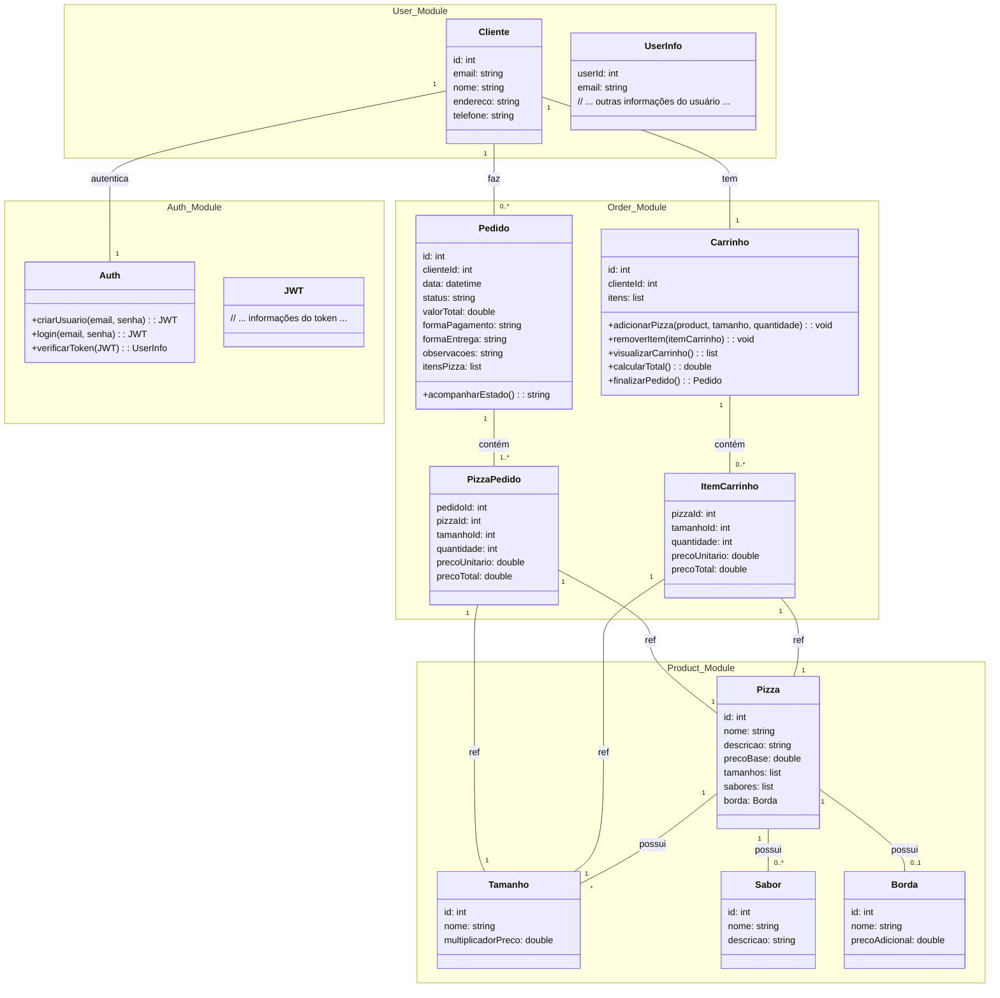

# Sistema de Pedidos de Pizza - Backend

Este é um backend para um sistema de pedidos de pizza, desenvolvido com Spring Boot, Spring Modulith e outras tecnologias modernas.

## Visão Geral

O Sistema de Pedidos de Pizza é uma aplicação que permite:
- Autenticação e gerenciamento de clientes
- Catálogo de produtos (pizzas, tamanhos, sabores, bordas)
- Carrinho de compras
- Processamento de pedidos
- Acompanhamento de status de pedidos

## Tecnologias Utilizadas

- **Java 21**
- **Spring Boot 3.4.4**
- **Spring Modulith** para arquitetura modular
- **Spring Data JPA** para persistência
- **Spring Security** com JWT para autenticação
- **Spring HATEOAS** para APIs RESTful
- **RabbitMQ** para mensageria
- **H2 Database** (para desenvolvimento)
- **OpenAPI/Swagger** para documentação da API
- **Flyway** para migração de banco de dados
- **Docker Compose** para serviços de infraestrutura

## Estrutura do Projeto

O projeto segue uma arquitetura modular usando Spring Modulith, organizado em módulos:

```
com.hyuse.pizzaOrderingBackend
├── auth/         # Autenticação e segurança
├── user/         # Gestão de usuários/clientes
├── products/     # Catálogo de produtos (pizzas, sabores, etc.)
├── cart/         # Carrinho de compras
├── order/        # Processamento e gestão de pedidos
├── infra/        # Componentes de infraestrutura
└── config/       # Configurações gerais
```

## Como Executar

### Pré-requisitos
- Java 21
- Docker e Docker Compose (para RabbitMQ)
- Gradle

### Passos para Execução

1. Clone o repositório:
   ```
   git clone <url-do-repositorio>
   cd pizza-ordering-backend
   ```

2. Inicie os serviços de infraestrutura:
   ```
   docker-compose up -d
   ```

3. Execute a aplicação:
   ```
   ./gradlew bootRun
   ```

4. Acesse a documentação da API:
   ```
   http://localhost:8080/swagger-ui.html
   ```

## Documentação do Módulo

Para gerar a documentação do Spring Modulith:

```
./gradlew modulithStructure
./gradlew generateModulithDocs
```

## Diagrama de Classe



## API Endpoints

A documentação completa da API está disponível via Swagger/OpenAPI na aplicação em execução. Os principais endpoints incluem:

- `/api/auth` - Endpoints de autenticação
- `/api/users` - Gestão de usuários/clientes
- `/api/products` - Gestão do catálogo de produtos
- `/api/cart` - Operações do carrinho de compras
- `/api/orders` - Gestão de pedidos

## Desenvolvimento

### Adicionar Funcionalidades

Para adicionar novas funcionalidades, recomenda-se seguir a abordagem modular:

1. Identifique o módulo apropriado ou crie um novo se necessário
2. Implemente entidades, repositórios, serviços e controllers conforme necessário
3. Siga os princípios de design SOLID e DDD

## Licença

[Especificar a licença do projeto]